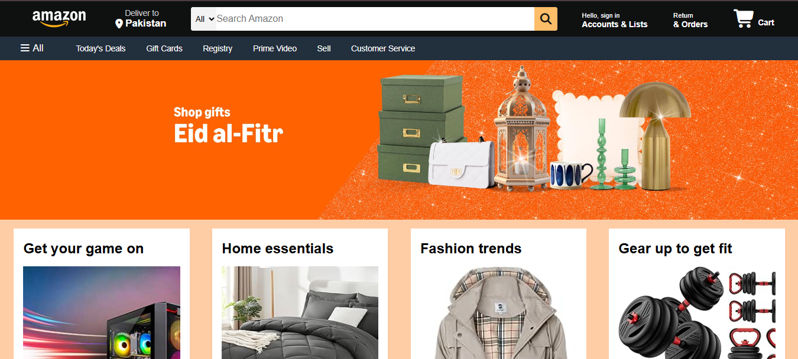

# 🛒 Amazon Clone

A front-end clone of the Amazon homepage built with pure HTML and CSS.

---

## 🔗 Live Demo

👉 [Click here to view the live project](https://azizullah-fedev.github.io/amazon-clone/)

---

## 📸 Screenshot



---

## 📌 About The Project

This project is a pixel-perfect clone of the Amazon homepage. It was built as a practice project to strengthen my HTML and CSS skills — especially layout design using Flexbox.

---

## 🛠️ Built With

- **HTML5** — Page structure and content
- **CSS3** — Styling and layout
- **Flexbox** — Navigation bar and product grid layout

---

## ✨ Features

- ✅ Fully styled navigation bar with search box
- ✅ Hero/banner section with background image
- ✅ Product category boxes grid
- ✅ Footer with multiple columns
- ✅ Hover effects on buttons and links

---

## 📂 Folder Structure

```
amazon-clone/
│
├── index.html
├── style.css
├── amazon_logo.png
├── Hero-image.jpg
├── box1-image.jpg
├── box2-image.jpg
├── box3-image.jpg
├── box4-image.jpg
├── box5-image.jpg
├── box6-image.jpg
├── box7-image.jpg
└── box8-image.jpg
```

---

## 🚀 How To Run Locally

1. Clone this repository:
```bash
git clone https://github.com/azizullah-FEDev/amazon-clone.git
```

2. Open the project folder
3. Double click on `index.html`
4. The project opens in your browser!

---

## 🎯 What I Learned

- Building complex navigation bars with Flexbox
- Working with background images and overlays
- Creating multi-column layouts using CSS
- Organizing a real-world project folder structure

---

## 👨‍💻 Author

**Your Name**
- GitHub: [@azizullah-FEDev](https://github.com/azizullah-FEDev)
- LinkedIn: [Aziz Ullah](https://www.linkedin.com/in/azizullah0348/)

---

## 📈 Future Improvements

- [ ] Make the page fully responsive for mobile
- [ ] Add JavaScript for search bar functionality
- [ ] Add a working shopping cart

---

⭐ If you like this project, please give it a star on GitHub!
